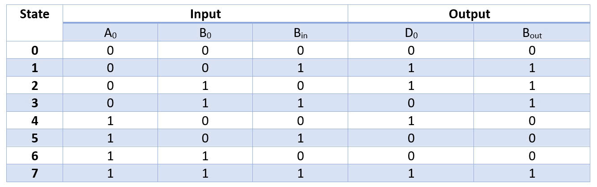
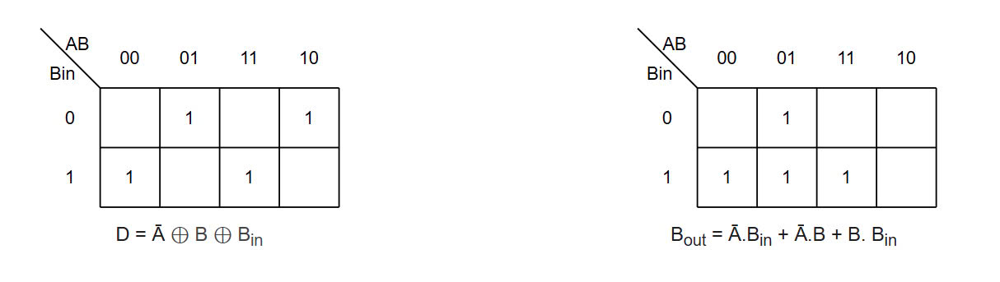

# DESIGN FULL SUBTRACTOR 4-BIT CIRCUIT USING DIGITAL DESIGN (RTL, DESGIN VERTIFICATION)

## Introduction
***
### Full Subtractor 1-bit

Phép trừ thực ra là phép cộng với số âm. Để có số âm của 1 số ta lấy bù 1 của số đó, còn khi thực hiện mạch thì đó là cổng đảo

Truth table

Karnaugh map

### Exetension to Full Subtractor 4-bit
Với mạch trừ nhị phân nhiều bit, cũng có thể thực hiện song song các mạch cộng FS từng bit nhưng các bit của số bị trừ cần được đảo, số nhớ của tầng cuối cần đem về bit nhớ ban đầu của tầng đầu.

