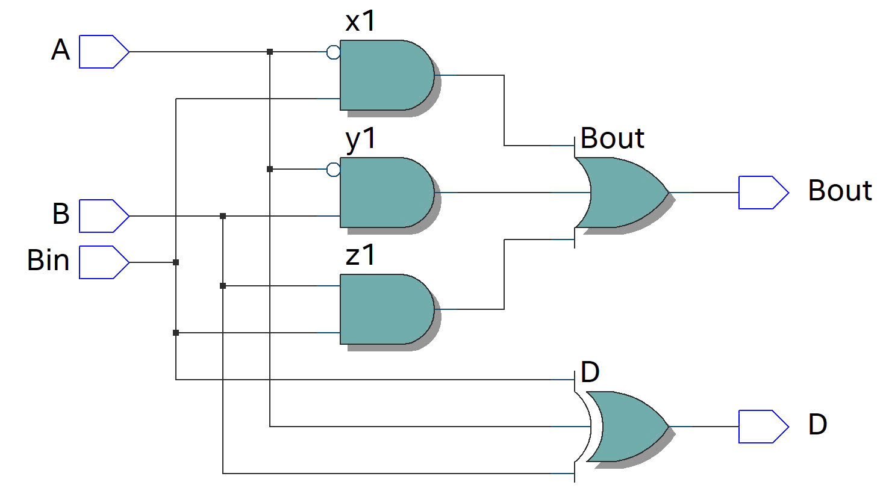
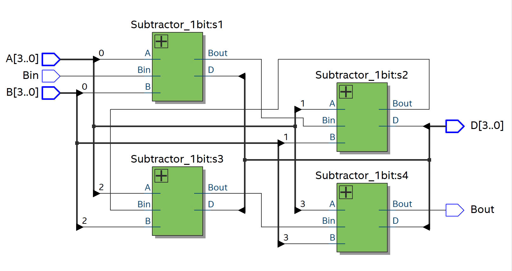
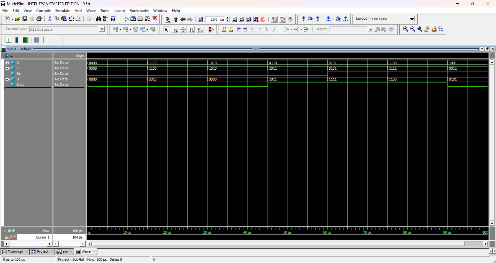

# DESIGN FULL SUBTRACTOR 4-BIT CIRCUIT ACCORDING TO THE DIGITAL CIRCUIT DESIGN FLOW (RTL, DESGIN VERTIFICATION)

## Requirements to Execute the Project
- QuartusPrime
- ModelSim

## Introduction

- With a 4-bit binary subtraction circuit, it is also possible to execute bitwise FS adders in parallel, but the bits of the subtracted number need to be inverted, and the carry of the last stage needs to be brought back to the original carry bit of the first stage.
## Design Circuit
### Step 1: Truth table
- Analyzing truth table

### Step 2: Karnaugh map
- Logical expression of D and Bout

### Step 3: Full Subtractor 1-bit
- Writing code and compile

### Step 4: Extension Full Subtractor 4-bit
- Parallel implementation of 4 1-bit circuits

### Step 5: Testbench 
- Simulate the waveform to match the circuit functionality

As seen in the simulation, the circuit functions as follows:

 At the time 0 - 15ps:
<ul>
   <li> Input:  "A" = 0000, "B" = 0000, "Bin" = 0 </li>
   <li> Output: "D" = 0000, "Bout" = 0 </li>
</ul>   

 At the time 15 - 30ps:
<ul>
   <li> Input:  "A" = 1110, "B" = 1100, "Bin" = 0 </li> 
   <li> Output: "D" = 0010, "Bout" = 0 </li> 
</ul>
    
    
 At the time 30 - 45ps:
<ul>
     <li> Input:  "A" = 1010, "B" = 1010, "Bin" = 0 </li>
     <li> Output: "D" = 0000, "Bout" = 0</li>
</ul>    

  At the time 45 - 60ps:
 <ul>
    <li> Input:  "A" = 0110, "B" = 1011, "Bin" = 0 </li>
    <li> Output: "D" = 1011, "Bout" = 1 </li>
 </ul>
 
  At the time 60 - 75ps:
  <ul>
    <li> Input:  "A" = 0101, "B" = 0101, "Bin" = 1 </li>
    <li> Output: "D" = 1111, "Bout" = 1 </li>
  </ul>
   At the time 75 - 90ps:
  <ul>
    <li> Input:  "A" = 1100, "B" = 1111, "Bin" = 1 </li>
    <li> Output: "D" = 1100, "Bout" = 1 </li>
 </ul>
   At the time 90 - 100ps:
  <ul>
    <li> Input:  "A" = 1001, "B" = 0011, "Bin" = 1 </li>
    <li> Output: "D" = 0101, "Bout" = 0 </li>
  </ul>
